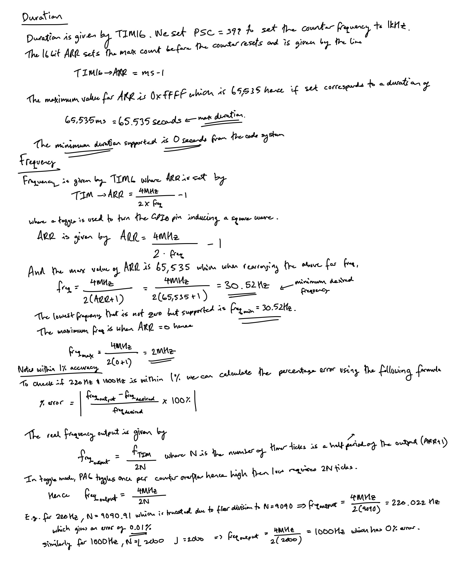
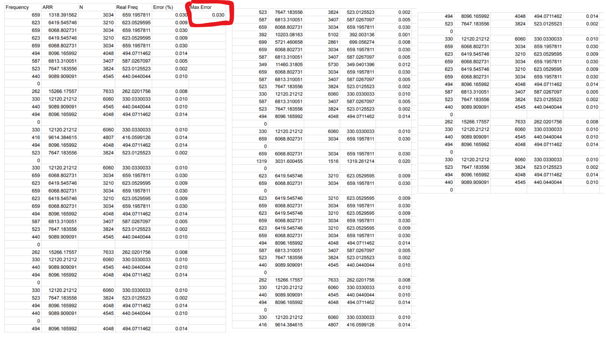
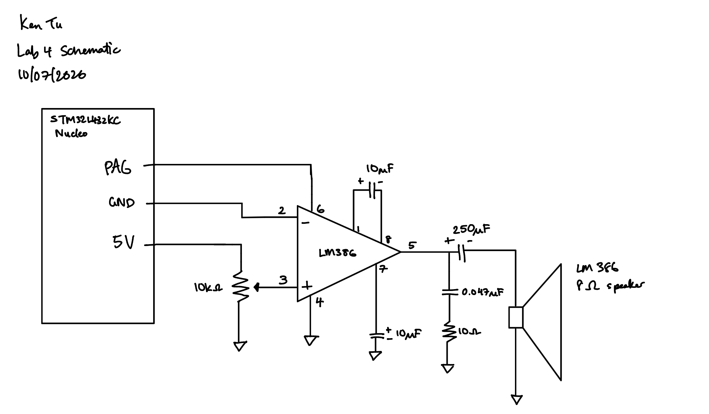
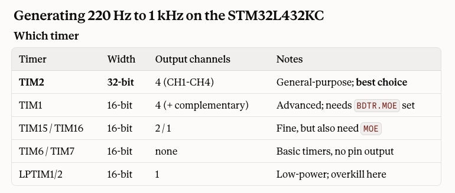
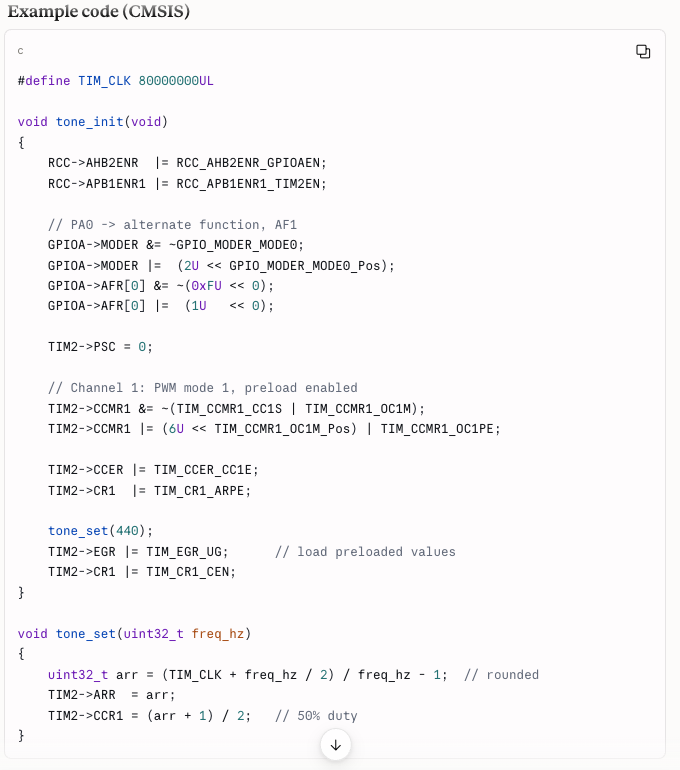

<!-- This is how you write a comment in your .qmd file -->
## Introduction

In this lab, I used the MCU to play music by using two timers on the board namely the TIM6 and TIM16 to generate square square waves. These square waves were toggles at specific frequency for defined durations. The music provided in this lab is given in the form of a list of tuples where the first element of the tuple is the frequency of the note and the second element is the duration in milliseconds. The provided sequence of tuples results in the tune Fur Elise by Beethoven.

## Design and Testing Methodology

When designing this system, I used the example blink file to view how existing drivers flash to the PB3 GPIO pin. Once the basic setup with the blinking LED was completed, I followed the style of how drivers were coded for timers and coded drivers for TIM6 and TIM16. This means that I wrote header files for the TIM6 and TIM16 registers. I determined that I would use TIM6 to control the frequency of the toggle rate -- which sets the frequency of the note and I would use the TIM16 to control the duration of the note. When instantiating TIM6 and TIM16, I intially set both their prescale values to 0 and their auto-reload registers 0xFFFF the maximum value. My plan was to configure these fields to provide the specified frequency and duration when I used them in their functions. In the setup, I also had to enable both timers and the GPIOA pin for PA6 to have toggle functionality. The GPIOA PA6 pin was connected to an 8-ohm speaker using an LM386 audio amplifier with a gain of 200.

To play the music I wrote a while loop iterating through each tuple in the music. 

Below are my calculations to show the minimum and maximum duration supported, the minimum and maximum frequency supported, and calculations which show that all the notes in Fur Elise can be replicated to within 1% accuracy.

::: {.callout-note collapse="true"}
## Figure 1: Minimum and maximum calculations for the frequency and duration supported

:::

The maximum error for a note is 0.03% which is well below the 1% error tolerance level. See the highlighted red box. We essentially repeat the calculation for all the notes in Fur Elise.

::: {.callout-note collapse="true"}
## Figure 2: Sheet with exhaustive calculation of percentage error of all notes in Fur Elise. 

:::

## Technical Documentation

The source code for the project can be found in the associated [Github repository](https://github.com/KenDTu/E155-Portfolio).


::: {.callout-note collapse="true"}
## Figure 3: Lab 4 Schematic

:::

<!-- ::: {.callout-note collapse="true"}
## Figure X: Image title

{#fig-blockdiagram}

::: -->

<!-- ::: {.callout-note collapse="true"}
## Figure X: Image title

```systemverilog
module top(
    input  logic clk,
    output logic [3:0] led
);
endmodule
```

::: -->

The GPIOA PA6 toggles at the desired frequency for a specified duration to oscillate the diaphragm of the microphone. 

## Results 

The result is that Fur Elise and my chosen song of Happy Birthday is successfully able to be played on the microphone. You can from Fur Elise to Happy Birthday by altering the `note[]` in to be `note1[]` inside the while loop. 

## Conclusion

I was able to successfully achieve the goals for this lab to play Fur Elise and a song of my own choice using the timers onboard the STM microcontroller. In total I spend 30 hours on this lab. Jumping and practice the skill of reading the block diagram and debugging which bits in which register to turn on was useful to help me know which sections to turn on and off. It was also valuable debugging how a counter can be set and reset to oscillate a signal in real time.

## AI Prototype Summary

For this lab, students were tasked to see if “What timers should I use on the STM32L432KC to generate frequencies ranging from 220Hz to 1kHz? What’s the best choice of timer if I want to easily connect it to a GPIO pin? What formulae are relevant, and what registers need to be set to configure them properly?" We were told to prompt our favorite LLM.

I used Claude AI and it suggests that TIM2 would be the best first for two main reasons. (1) The TIM2 is 32 bits wide as opposite to my choice of using the TIM16 and TIM6 which both are 16 bits wide. This means TIM2 has a higher resolution for the frequency of choice, however, this does not really matter because in software we are rounding the numbers for ARR regardless when you set it. (2) Claude also mentions that TIM2 is the simplest to use because it has no break/dead-time logic, so we don't need to set up MOE -- I'm not sure what does it but it doesn't look like we set this up using TIM6 or TIM16 either. Claude also provided some example code to set up TIM2.

In summary, I think the Claude was a good starting point especially with the table to analyze the trade offs between each timer but I don't think the advice should be followed verbatim. I draw on this conclusion based on the lack of relevant explanation for the set up MOE argument.

::: {.callout-note collapse="true"}
## Figure 4: Claude's timer advice

:::

::: {.callout-note collapse="true"}
## Figure 5: Claude's TIM2 setup to set the frequency

:::


